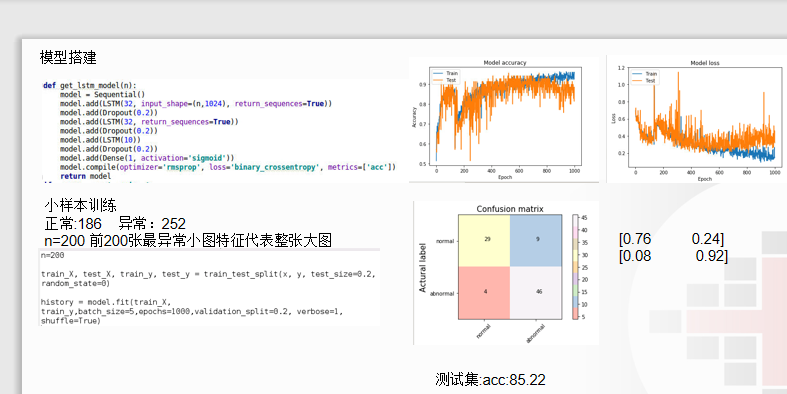

# 毒性病理学

## 项目背景介绍

## 项目流程

## pathology GAN\Resnet50\Vgg16环境
    # 修改cuda软链接 cuda-9.0_GAN 在totem/fuquan/cuda-9.0_GAN
    cd /usr/local
    ln -snf cuda-9.0_GAN/ cuda
    pip uninstall tensorflow-gpu
    pip install tensorflow-gpu==1.12.0
    pip install tensorflow-probability==0.5.0
    pip uninstall keras
    pip install keras==2.2.0
    
    # pathology GAN图像预处理
    img=cv2.bilateralFilter(slide_region,10,15,15)
    img = img/255
    
    # VGG16\Resnet50图像预处理
    x = slide_region/255.0
    x = imagenet_processing(x)
    
    
## 数据集解释

机子：211

目录：/cpjack/totem/Toxicology

Toxicology

    pictures 存放patch图片
        224 日本数据集正常图224*224
        abnormal_224 异常图224*224
        PDF_extract  医生标注的异常图
        test_224 测试所用的正常图

    Set 1 Japan 存放日本数据集

    Resnet50features 存放Resnet50生产的数据
    Pathologyfeatures存放Pathology生产的数据
    VGG16features 存放VGG16生产的数据
        model 存放训练好的模型LOF\OCSVM\IForest
        parm  存放模型参数
        test_svs 存放测试的svs大图的位置和特征信息
        test_224.csv 存放测试特征信息
        train_224.csv 存放训练特征信息
        Train 存放训练集的特征
            Normal
            Abnormal
        Test 存放测试集的特征
            Normal
            Abnormal
## 代码解释
## cut		切图

	cut_bmp.py将医生标注的异常部位数据PDF_extract进行切割
	放在abnormal_224文件内
        
    cut_normal.py将Set 1 Japan/train里面的正常图（81张）取前71张进行切割放在[224](#224)文件内
    共20万张。（先切割图片放入tmp2文件夹内，后从tmp2文件夹随机取20万张放入224文件夹）
        
    cut_normal_test.py将Set 1 Japan/train里面的正常图（81张）取后10张进行切割放在[test_224](#test_224)文件内
    共6104张。（先切割图片放入tmp文件夹内，后从tmp文件夹随机取6104张放入test_224文件夹）

## get_features	提取特征

    get_test_features.py将test_224文件夹和abnormal_224内的全部图片，用VGG16提取512个特征，
    存放在test_224.csv中。异常标记为1，正常标记为0.
        
    get_train_features.py将224文件夹内的全部图片，用VGG16提取512个特征，
    存放在train_224.csv中.

## model  模型
    resnet50调用GPU需要去cuda-9.0官网下载安装4个补丁，2080与cuda9.0不兼容的问题Blas SGEMM launch failed
    详细见: https://blog.csdn.net/weixin_38603360/article/details/101771847
    get_vfeatures_model.py是获取vgg16|Resnet50模型文件，模型最后用avg将7×7×512|7×7×2048的特征压缩为512个特征。
    vgg16原模型/cptjack/sys_software_bak/keras_models/models/vgg16_weights_tf_dim_ordering_tf_kernels_notop.h5
    Resnet50原模型/cptjack/sys_software_bak/keras_models/models/resnet50_weights_tf_dim_ordering_tf_kernels_notop.h5
    plt出模型出来需要配置一下
    #Linux配置环境
    sudo apt-get install graphviz
    pip install graphviz
    pip install pydot
    pip install pydot-ng
    from keras.utils import plot_model
    plt_model(model,"model.png",show_shapes=True)

## pictures 存放预测图片

    o开头的是原图（o26761.png）
    26761.png是热图

## predict 预测

    predict.py
        先获取get_features特征和位置信息
        predict_proba对特征进行预测，判断异常的概率
        draw根据位置信息和预测结果画出热图

## train 训练
    LOFkc.py 模型训练，搜索最优参数
 

    IForestkc.py 模型训练，搜索最优参数

    OCSVMkc.py 模型训练，搜索最优参数

## utils 方法
    utilts.py
         read_roc_csv读取测试集
         get_acu获取模型的auc值
         plot_roc画出模型的roc曲线
         get_acc 获取模型的准确率以及print出混淆矩阵
         get_steps 获取模型能够切多少到
         judge 判断切出来的图片是否丢弃
         show2 显示模型在测试集的效果
         imagenet_procession 图像预处理
         get_mpp 获取slide图片mpp值
    运行utilts.py可获取（LOF）模型的所用指标结果（roc曲线，descision_function，auc，acc等）
    mpp_analysis.py 对数据集mpp值进行分析

## parm.py 参数

## 预测效果图如下

Japan normal

Japan moderate

Japan severe

用OCSVM模型获得最异常的200个patch代表整张图，放入LSTM训练预测病理切片的标签

